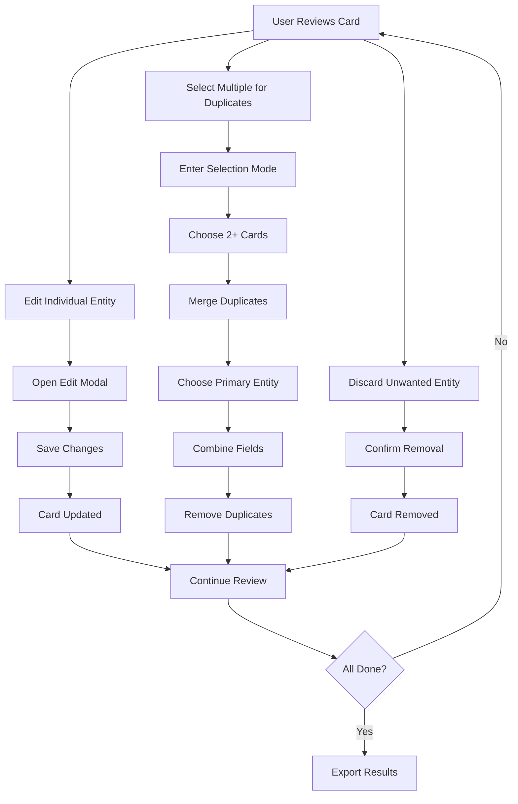
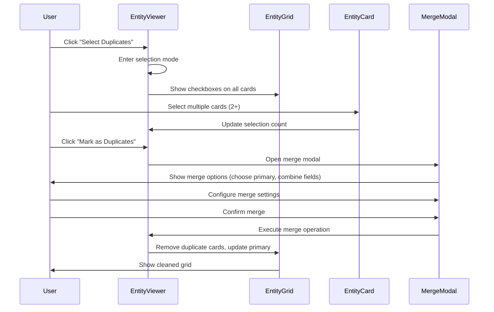
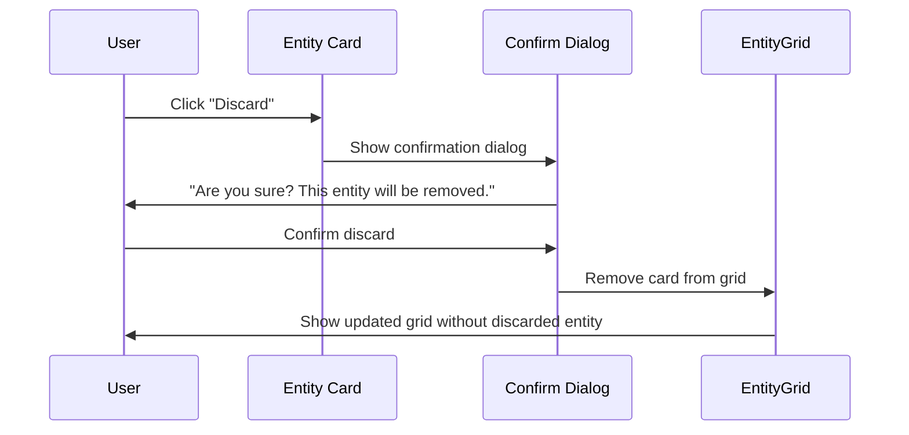
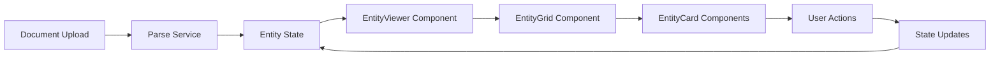

# Interactive Manual Entity Cleanup Process

This document describes the user flow for the interactive entity cleanup process after document parsing.

## Flow Diagrams

### 1. High-Level Process Flow

```mermaid
flowchart LR
    A[📄 Upload Document] --> B[🔍 Parse Entities]
    B --> C[📋 Review Cards]
    C --> D[✏️ Interactive Cleanup]
    D --> E[📤 Export Results]
    
    style A fill:#e1f5fe
    style B fill:#f3e5f5
    style C fill:#e8f5e8
    style D fill:#fff3e0
    style E fill:#f1f8e9
```



### 2. Entity Card Information Display

```mermaid
flowchart TD
    Card[Entity Card] --> Parsed[✅ Parsed Fields]
    Card --> Missing[⚠️ Missing Fields]
    Card --> Duplicate[🔄 Duplicate Status]
    Card --> Actions[🎯 Available Actions]
    
    Parsed --> P1[Name/Title]
    Parsed --> P2[Type/Kind]
    Parsed --> P3[Description]
    
    Missing --> M1[Role]
    Missing --> M2[Faction]
    Missing --> M3[Status]
    
    Duplicate --> D1[Auto-detected]
    Duplicate --> D2[User-marked]
    
    Actions --> A1[Edit]
    Actions --> A2[Mark Duplicate]
    Actions --> A3[Discard]
```



### 3. User Action Workflows



## Detailed User Stories

### 1. Document Upload & Parse

- **As a user**, I upload a campaign document (MD/DOC)
- **The app** parses entities and displays them as cards
- **Each card shows** parsed fields, missing field warnings, and potential duplicate indicators

### 2. Entity Card Review

- **As a user**, I can see at a glance:
  - ✅ **Parsed Fields**: Successfully extracted data (name, type, description)
  - ⚠️ **Missing Fields**: Required fields that need manual input (role, faction, status)
  - 🔄 **Potential Duplicates**: Auto-detected similar entities highlighted
  - 🎯 **Actions Available**: Edit, Mark Duplicate, Discard, Keep Separate

### 3. Interactive Actions

#### Edit Entity (Individual Cleanup)

```mermaid
sequenceDiagram
    participant U as User
    participant C as Entity Card
    participant M as Edit Modal
    participant S as State Manager
    
    U->>C: Click "Edit" on card
    C->>M: Open edit modal
    M->>U: Show form with current + missing fields
    U->>M: Fill in missing data
    U->>M: Correct any parsing errors
    U->>M: Click "Save"
    M->>S: Update entity data
    S->>C: Refresh card display
    C->>U: Show updated card with ✅ complete status
```



#### Mark as Duplicates (Batch Cleanup)



#### Discard Entity



## Current Implementation Status

### ✅ Completed Features

- [x] Document upload and parsing
- [x] Entity card display with parsed fields
- [x] Missing field indicators
- [x] Auto-detected duplicate highlighting
- [x] Edit modal for individual entities
- [x] Selection mode for manual duplicate marking
- [x] Basic duplicate merging logic

### 🚧 In Progress

- [ ] Discard functionality
- [ ] Merge modal for duplicate resolution
- [ ] Final review and export options
- [ ] Session persistence

### 💡 Enhancement Ideas

- [ ] Undo/Redo for actions
- [ ] Bulk edit operations
- [ ] Custom duplicate detection rules
- [ ] Export format options (JSON, CSV, XML)
- [ ] Entity relationship visualization
- [ ] Confidence scores for auto-detected duplicates

## Technical Architecture Notes

### State Management Flow



### Component Hierarchy

```text
EntityViewer (State Management)
├── EntityFilters (Filtering & Search)
├── SelectionControls (Duplicate Actions)
├── EntityGrid (Layout)
│   └── EntityCard[] (Individual Items)
│       ├── ParsedFields
│       ├── MissingFieldWarnings
│       ├── DuplicateIndicators
│       └── ActionButtons
├── EntityEditModal (Individual Edit)
└── EntityMergeModal (Duplicate Resolution)
```

This flow ensures a comprehensive, user-friendly cleanup process that handles the complexity of entity management while keeping the interface intuitive.
