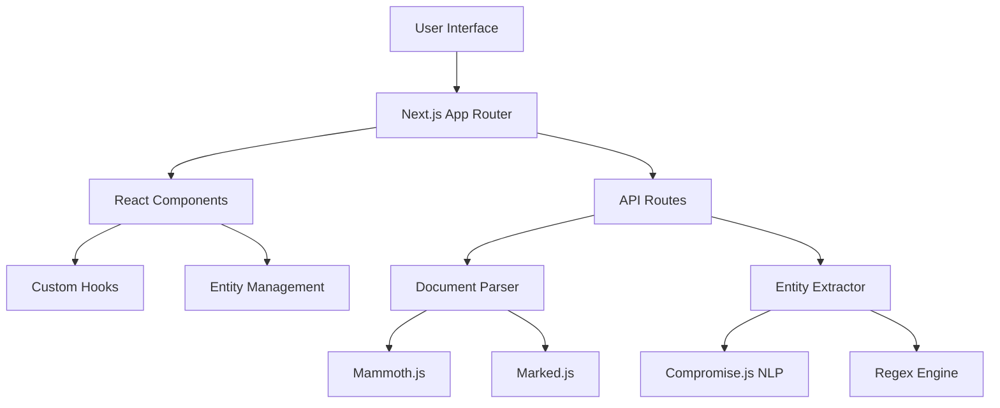
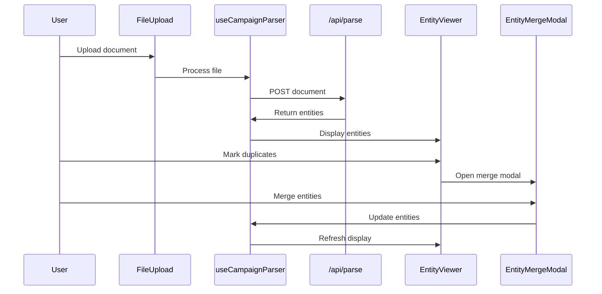

# 🏗️ Architecture Overview

## System Architecture

The Campaign Document Parser is built on **Next.js 16** with a unified frontend/backend architecture that replaced a complex monorepo setup.

### High-Level Architecture



## Technology Stack

### Frontend

- **Next.js 16**: App Router with React Server Components
- **React 18+**: With React Compiler for automatic optimization
- **TypeScript**: Strict type safety throughout
- **Tailwind CSS**: Utility-first styling
- **React Hot Toast**: User notifications

### Backend (API Routes)

- **Next.js API Routes**: Replace Express server
- **Node.js**: Server-side JavaScript runtime
- **File Processing**: FormData API for uploads

### Document Processing

- **Mammoth.js**: Word document (.docx) parsing
- **Marked.js**: Markdown parsing and HTML conversion
- **Gray-matter**: YAML frontmatter extraction

### Entity Extraction

- **Compromise.js**: Natural Language Processing engine
- **Custom Regex Engine**: Pattern-based fallback extraction
- **Campaign Dictionaries**: D&D-specific entity recognition

### Testing & Quality

- **Jest**: Unit and integration testing framework (260 tests)
- **React Testing Library**: Component testing utilities
- **Real Data Testing**: Authentic D&D session content for validation
- **ESLint**: Code quality and consistency
- **TypeScript Compiler**: Static type checking

## Clean Architecture Structure

Following **Clean Architecture** principles with clear separation between core domain logic and external concerns:

```tree
src/
├── app/                    # Next.js App Router
│   ├── api/               # API routes (replaces Express)
│   │   ├── health/        # Health check endpoint
│   │   ├── parse/         # Document processing endpoint  
│   │   └── export/        # Obsidian export endpoint
│   ├── layout.tsx         # Root layout component
│   └── page.tsx           # Main application page (refactored)
├── components/            # React components
│   ├── Document/          # File upload & parsing UI
│   │   ├── ActionButtons/ # Process/reset controls
│   │   ├── FileUpload/    # Drag & drop interface
│   │   └── ParsedResults/ # Results display
│   ├── Entity/            # Entity management system
│   │   ├── EntityCard/    # Individual entity display
│   │   ├── EntityGrid/    # Entity list container
│   │   ├── EntityViewer/  # Main management interface
│   │   ├── EntityEditModal/ # Entity editing form
│   │   ├── EntityMergeModal/ # Deduplication interface
│   │   └── EntityFilters/ # Filtering & search
│   └── Layout/            # Application layout
│       ├── PersistentWelcome/ # Always-visible welcome & entity types
│       ├── WelcomeSection/    # Demo-only welcome message
│       ├── ProcessingWorkflow/ # Smart upload/reset workflow
│       └── ResultsSection/    # Results display container
├── hooks/                 # Custom React hooks
│   ├── useCampaignParser.ts  # Document processing state
│   └── useFileManager.ts     # File validation & upload
├── client/                # � Client HTTP utilities
│   └── api.ts            # Simple axios calls to API routes
├── lib/                   # 🎯 Shared utilities (client + server safe)
│   ├── documentParser/    # Core: Document processing
│   │   ├── documentParser.ts  # Word/Markdown parsing
│   │   └── index.ts           # Module exports
│   ├── entityExtractor/   # Core: Entity extraction  
│   │   ├── entityExtractor.ts     # NLP + regex processing
│   │   ├── nlpEntityExtractor.ts  # Alternative NLP engine
│   │   └── index.ts               # Module exports
│   └── templateEngine/    # Core: Template processing
│       ├── templates/     # Handlebars templates
│       │   ├── npc.md         # NPC entity template
│       │   ├── location.md    # Location entity template
│       │   ├── item.md        # Item entity template
│       │   ├── quest.md       # Quest entity template
│       │   └── session-summary.md # Session template
│       ├── templateEngine.ts  # Template compilation & processing
│       ├── templateEngine.test.ts # Template tests
│       ├── obsidian_vault_tree.txt # Vault structure reference
│       ├── README.md          # Template documentation
│       └── index.ts           # Module exports
└── types/                 # TypeScript definitions
    ├── campaign.ts        # Entity type definitions
    ├── document.ts        # Document structure types
    └── index.ts           # Unified exports

__mocks__/                 # Test fixtures and example data
├── expected_obsidian_output/      # Template validation outputs
├── session_summary_1_rawdata.json    # Raw extracted entities
├── session_summary_1_manual_deduped.json # Deduplicated data  
└── session_summary_1.md              # Example parsed document
```

### Architecture Principles

**🎯 Shared Utilities** (src/lib/):

- **Pure domain logic**: No external dependencies
- **Client + Server safe**: Can be imported anywhere
- **Stateless functions**: Deterministic, testable operations
- **documentParser**: File format processing (Word/Markdown → structured data)
- **entityExtractor**: NLP/regex entity detection (text → entities)
- **templateEngine**: Template processing (entities → markdown)

**🌐 Client HTTP Layer** (src/client/):

- **Browser-only code**: Simple HTTP utilities using axios
- **API communication**: Calls to Next.js API routes
- **No business logic**: Pure transport layer

**🚀 Server Business Logic** (src/app/api/):

- **API routes contain business logic**: Next.js native pattern
- **Direct import of utilities**: No service layer needed
- **Server-only code**: Full Node.js access

### Simplified Next.js Architecture

**Next.js Native Patterns:**

- **API routes ARE the server**: No separate service layer needed
- **Client HTTP utilities**: Simple, focused transport layer
- **Shared utilities**: Pure functions safe for both environments
- **Build Process**: Turbopack validates all import chains

**Implementation Strategy:**

```typescript
// ✅ Client-side: Simple HTTP calls
// client/api.ts
import axios from 'axios';
export const exportEntities = async (entities) => 
  axios.post('/api/export', { entities });

// ✅ Server-side: Business logic in API routes
// app/api/export/route.ts  
import { initializeTemplates, processEntities } from '@/lib/templateEngine';
export const POST = async (request) => {
  await initializeTemplates();
  const processedFiles = await processEntities(entities);
  // Business logic lives here, not in separate services
};

// ✅ Shared utilities: Pure functions
// lib/templateEngine/templateEngine.ts
export const processEntity = (entity) => { /* pure function */ };
```

**Benefits:**

- **Next.js Native**: Follows framework conventions
- **Reduced Complexity**: 50% less architectural overhead
- **Clear Boundaries**: Client transport vs server business logic  
- **Type Safety**: Simpler import chains, fewer errors

## Component Architecture

### Entity Management Flow



### State Management

The application uses a **hooks-based state management** approach:

- **useCampaignParser**: Central document and entity state
- **useFileManager**: File validation and upload state  
- **useEntityFiltering**: Search and filter state
- **useEntitySelection**: Multi-select and bulk operations

## API Architecture

### RESTful Endpoints

```typescript
// Health Check
GET /api/health
Response: { status: "ok", timestamp: string }

// Document Processing  
POST /api/parse
Body: FormData with 'file' field
Response: {
  content: MarkdownContent | WordContent,
  entities: AnyEntity[],
  metadata: DocumentMetadata
}

// Obsidian Export
POST /api/export
Body: { entities: AnyEntity[], options?: ExportOptions }
Response: ZIP file with organized markdown files
```

### Request/Response Flow

1. **File Upload**: FormData processing in Next.js API route
2. **Document Parsing**: Mammoth.js (Word) or Marked.js (Markdown)  
3. **Entity Extraction**: Dual-engine NLP + regex processing
4. **Response**: Structured document + extracted entities

## Data Models

### Core Entity Types

```typescript
type BaseEntity = {
  kind: EntityKind;
  title: string;
  sourceSessions?: number[];
}

type NPC = BaseEntity & {
  kind: "npc";
  role?: string;
  faction?: string;
  importance?: "minor" | "supporting" | "major";
}

type Location = BaseEntity & {
  kind: "location";
  type?: string;
  region?: string;
}

type Item = BaseEntity & {
  kind: "item";
  type?: string;
  rarity?: "common" | "uncommon" | "rare" | "very_rare" | "legendary";
}

type Quest = BaseEntity & {
  kind: "quest";
  status: "active" | "completed" | "failed" | "available";
  type?: "main" | "side" | "personal";
}
```

### Document Structure

```typescript
type ParsedDocument = {
  filename: string;
  type: DocumentType;
  content: MarkdownContent | WordContent;
  entities: AnyEntity[];
}

type MarkdownContent = {
  frontmatter?: Record<string, any>;
  markdown: string;
  headings: Heading[];
  links: Link[];
}
```

## Performance Optimizations

### React Compiler Integration

The application uses **React Compiler** for automatic optimization:

- **Automatic Memoization**: Entity operations are optimized without manual `useMemo`
- **Smart Re-rendering**: Component updates only when necessary  
- **Entity List Performance**: Large entity lists render efficiently

### Next.js Optimizations

- **App Router**: Server Components where appropriate
- **Code Splitting**: Automatic route-based code splitting
- **Static Assets**: Optimized asset delivery
- **API Routes**: Edge-optimized server functions

### Entity Processing

- **Dual-Engine Extraction**: NLP primary, regex fallback
- **Batch Processing**: Efficient bulk entity operations
- **Smart Caching**: Component-level state optimization

## Security Considerations

### File Upload Security

- **MIME Type Validation**: Strict file type checking
- **Size Limits**: 10MB maximum file size
- **Content Scanning**: Document content validation
- **Sanitization**: HTML output sanitization

### API Security

- **Input Validation**: Request payload validation
- **Error Handling**: Secure error responses
- **Rate Limiting**: (Recommended for production)
- **CORS**: Configured for Next.js environment

## Migration from Monorepo

### Before (Complex)

- **4 separate applications**: client, server, shared, root
- **Multiple ports**: 3000 (client), 3005 (server)
- **Proxy configuration**: Complex routing setup
- **Build orchestration**: Sequential builds required
- **Deployment coordination**: Multiple artifacts

### After (Simplified)  

- **Single Next.js application**: Unified frontend/backend
- **Single port**: 3000 for everything
- **Direct API routes**: No proxy needed
- **Single build**: `npm run build`
- **Single deployment**: `.next/` artifact

This architecture delivers a **75% reduction in configuration complexity** while enhancing functionality with entity deduplication and modern optimizations.
