# 🏗️ Clean Architecture Migration

## Overview

This document describes the **Clean Architecture reorganization** of the `src/lib/` directory, completed in November 2025 to improve code organization and maintainability.

## Migration Summary

### Before: Mixed Organization

```text
src/lib/
├── export/                    # ❌ Confusing name - contained templates, not export logic
│   ├── templateEngine.ts      
│   └── templates/
└── services/                  # ❌ Mixed abstraction levels
    ├── documentService.ts     # HTTP client (infrastructure)
    ├── exportService.ts       # Export orchestration 
    ├── documentParser/        # Core domain logic
    └── entityExtractor/       # Core domain logic
```

### After: Clean Architecture

```text
src/lib/
├── documentParser/            # 🎯 CORE MODULE: Document processing
├── entityExtractor/           # 🎯 CORE MODULE: Entity extraction  
├── templateEngine/            # 🎯 CORE MODULE: Template processing
└── services/                  # 🔧 SERVICES: Orchestration & Infrastructure
    ├── documentService.ts     # HTTP client
    └── exportService.ts       # Export coordination
```

## Architecture Principles

### 🎯 Core Modules (Inner Layer)

**Characteristics:**

- **Pure domain logic** - No external dependencies
- **Stateless functions** - Deterministic, testable operations  
- **No network calls** - Self-contained processing
- **Framework agnostic** - Can be used in any environment

**Modules:**

1. **`documentParser/`**
   - Converts files (Word/Markdown) into structured data
   - Dependencies: File parsing libraries (mammoth, marked)
   - Input: Raw file buffers
   - Output: Structured document objects

2. **`entityExtractor/`**  
   - Processes parsed documents to find entities using NLP/regex
   - Dependencies: NLP libraries (compromise.js)
   - Input: Parsed document content
   - Output: Extracted entity arrays

3. **`templateEngine/`**
   - Converts entities into formatted markdown using Handlebars
   - Dependencies: Template engine (handlebars)
   - Input: Entity objects
   - Output: Rendered markdown files

### 🔧 Services (Outer Layer)

**Characteristics:**

- **Infrastructure concerns** - API calls, network operations
- **Orchestration logic** - Coordinates multiple core modules
- **External integrations** - HTTP clients, database access
- **Framework specific** - Next.js API routes, React hooks

**Services:**

1. **`documentService.ts`**
   - HTTP client for `/api/parse` endpoint
   - Handles form data, network errors, response parsing
   - **Depends on**: External API (infrastructure)

2. **`exportService.ts`**
   - Export orchestration and vault organization
   - Coordinates templateEngine + metadata generation
   - **Depends on**: `templateEngine` (core module)

## Dependency Flow

```mermaid
graph TD
    A[Next.js API Routes] --> B[Services Layer]
    B --> C[documentService]
    B --> D[exportService]
    D --> E[templateEngine]
    C --> F[documentParser]
    C --> G[entityExtractor]
    
    subgraph "🔧 Services (Outer Layer)"
        B
        C
        D
    end
    
    subgraph "🎯 Core Modules (Inner Layer)"
        E
        F
        G
    end
```



**Key Rules:**

- ✅ **Services** can depend on **Core Modules**
- ❌ **Core Modules** cannot depend on **Services**  
- ✅ **Core Modules** can depend on other **Core Modules**
- ❌ No circular dependencies

## Benefits Achieved

### 1. **Clear Separation of Concerns**

**Before:**

- Mixed abstraction levels in single directory
- Unclear dependencies between modules
- Infrastructure and domain logic intermingled

**After:**

- **Core modules**: Pure domain logic, easily testable
- **Services**: Infrastructure and orchestration concerns
- **Clear boundaries**: Dependency direction enforced

### 2. **Improved Testability**

**Core Modules:**

- **Unit tests**: Test pure functions in isolation
- **No mocks needed**: No external dependencies to mock
- **Deterministic**: Same input always produces same output

**Services:**

- **Integration tests**: Test with mocked core modules
- **Clear interfaces**: Well-defined boundaries for mocking

### 3. **Better Reusability**

**Core Modules:**

- Can be **extracted** to separate packages if needed
- **Framework agnostic**: Work in any JavaScript environment
- **Composable**: Mix and match for different use cases

### 4. **Simplified Import Paths**

**Before:**

```typescript
import { parseDocument } from '@/lib/services/documentParser';
import { extractEntitiesRegex } from '@/lib/services/entityExtractor';  
import { templateEngine } from '@/lib/export/templateEngine';
```

**After:**

```typescript
import { parseDocument } from '@/lib/documentParser';
import { extractEntitiesRegex } from '@/lib/entityExtractor';
import { processEntity } from '@/lib/templateEngine';
```

## Migration Impact

### Files Moved

| Old Location | New Location | Type |
|-------------|-------------|------|
| `export/templateEngine.ts` | `templateEngine/templateEngine.ts` | Core Module |
| `export/templates/` | `templateEngine/templates/` | Templates |
| `services/documentParser/` | `documentParser/` | Core Module |
| `services/entityExtractor/` | `entityExtractor/` | Core Module |

### Import Path Updates

**Updated Files:**

- `src/app/api/parse/route.ts` - API route imports
- `src/app/api/parse/route.test.ts` - Test mocks
- `src/lib/services/exportService.ts` - Service dependencies
- `docs/entity-extraction.md` - Documentation examples

### Tests Status

- ✅ **All 98 tests passing** - No functionality lost
- ✅ **Template engine tests** - Moved and updated
- ✅ **API integration tests** - Import paths fixed
- ✅ **Component tests** - No changes needed

## Best Practices Established

### 1. **Module Organization**

- **One responsibility per module** - Clear, focused purpose
- **Dependency inversion** - Core modules independent of infrastructure  
- **Interface segregation** - Clean, minimal public APIs

### 2. **Functional Programming**

- **Pure functions preferred** over classes
- **Stateless operations** - No hidden state or side effects
- **Composition over inheritance** - Combine functions for complex operations

### 3. **Testing Strategy**

- **Unit tests** for core modules (no external dependencies)
- **Integration tests** for services (with mocked dependencies)
- **End-to-end tests** for complete workflows

### 4. **Documentation**

- **Architecture decisions** documented with rationale
- **Module purposes** clearly explained
- **Import examples** updated throughout codebase

## Future Considerations

### Potential Extractions

If modules grow large, consider further separation:

```text
src/lib/
├── parsing/               # Document parsing domain
│   ├── wordParser/       
│   ├── markdownParser/   
│   └── frontmatterParser/
├── extraction/           # Entity extraction domain  
│   ├── nlpExtractor/
│   ├── regexExtractor/
│   └── campaignDictionary/
├── templating/          # Template processing domain
│   ├── handlebarsEngine/
│   ├── obsidianFormatter/
│   └── vaultOrganizer/
└── services/           # Infrastructure & orchestration
```

### Package Boundaries

**Potential npm packages:**

- `@campaign-parser/document-parser` - Core document processing
- `@campaign-parser/entity-extractor` - NLP entity detection
- `@campaign-parser/obsidian-templates` - Template engine

### Framework Migration

**Clean Architecture benefits:**

- **Easy framework changes** - Core logic independent of Next.js
- **Portable modules** - Can move to Electron, CLI, or other environments
- **Technology upgrades** - Infrastructure changes don't affect core logic

## Post-Migration Fix: Client/Server Separation

### Issue Discovered

After the Clean Architecture migration, a **Next.js build error** occurred:

```bash
Error: Module not found: Can't resolve 'fs/promises'
Import chain: templateEngine.ts → exportService.ts → services/index.ts → useCampaignParser.ts → page.tsx
```

**Root Cause**: Client-side React components were importing server-only code through the services barrel export.

### Solution Applied

**Services Index Separation**:

```typescript
// Before: services/index.ts (caused client/server mixing)
export * from './documentService';
export * from './exportService';  // ❌ Contains Node.js dependencies

// After: services/index.ts (client-safe only)
export * from './documentService';  // ✅ HTTP client, browser-compatible
// export * from './exportService';  // ❌ Commented out - server-only

// Usage in API routes: Direct import
import { exportEntities } from '@/lib/services/exportService';
```

**Benefits of Fix**:

- ✅ **Build Success**: No more Node.js imports in client bundles
- ✅ **Clear Boundaries**: Explicit client vs server separation
- ✅ **Type Safety**: Import errors caught at build time  
- ✅ **Performance**: Smaller client bundles

### Architecture Lesson

**Clean Architecture Principle Validated**: Proper dependency separation prevents cross-boundary contamination. The services layer must carefully manage what it exposes to different environments (client vs server).

---

*This reorganization establishes a solid foundation for long-term maintainability and extensibility while preserving all existing functionality and ensuring proper Next.js client/server separation.*
